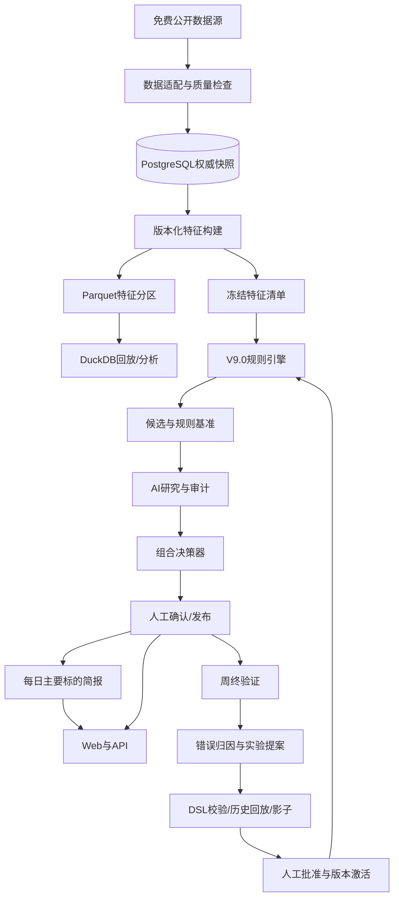

# 系统架构设计

> 状态：MVP 目标架构；工程、API契约、数据库迁移、每日简报、登录与用户管理、实验治理旁路、Parquet/DuckDB 特征产物基线和 Web 管理页已创建，其余模块开发中。

## 1. 技术选择

| 层 | 选择 |
|---|---|
| Web | React + TypeScript + Vite + Tailwind CSS + ECharts |
| API | Python + FastAPI + Pydantic |
| 业务数据库 | PostgreSQL |
| 历史分析 | DuckDB + Parquet |
| 调度 | APScheduler 起步，任务增长后再评估独立队列 |
| AI | OpenAI Responses API 优先的提供商接口；模型通过环境配置，保留确定性 Mock 和兼容提供商扩展点 |
| 部署 | Docker Compose，本机与云端保持同构 |

Redis、Celery/Dramatiq、对象存储和MCP不是MVP必需项，只有出现真实并发或扩展需求时引入。

## 2. 逻辑组件



模块边界：

- `data`：供应商适配、能力矩阵、声明式字段映射、规范化、质量、快照。
- `features`：确定性指标计算、版本化清单、Parquet 分区和 DuckDB 加速查询；加速层可重建且不反向写正式快照。
- `rules`：V9.0状态机、评分和组合约束；正式规则与实验 DSL 求值器隔离。
- `ai`：底稿、提供商、结构化分析和审计。
- `decisions`：三版本名单、人工确认和冻结。
- `briefs`：收盘后行情进度、证据变化、风险状态和 AI 摘要降级。
- `reviews`：周终指标、失败周反查和归因。
- `experiments`：受限 DSL 静态校验、walk-forward、影子运行、批准、激活与回滚；实验无正式发布写权限。
- `jobs`：周初、每日简报和周终任务的幂等触发、阶段、失败代码和恢复审计；worker 重启会补做已到期且未完成的准备与产出，任务失败不得伪造业务结果。
- `user_watchlist_items / user_watchlist_daily_items / user_watchlist_weekly_items`：按用户隔离的最多 5 只自选及其日度、周度产出；不与公共 `decision_sets` 建立决策依赖。
- `api/web`：低信息密度展示与按需证据。

## 3. 任务状态

周初任务采用显式状态：

`created → snapshot_ready → rule_ready → ai_ready/ai_degraded → awaiting_approval → approved → published → reviewed`

失败状态带错误类型和可重试性。发布操作必须幂等；同一 `week_id + version_type` 不得生成两个激活结果。

每日简报是发布后的独立日度任务：`created → market_data_ready → evidence_ready/evidence_degraded → ai_ready/ai_degraded → published`。简报失败不改变周度决策状态，也不得修改当周名单。

实验规则采用独立状态：`proposed → schema_validated → replay_queued → replay_running → replay_passed/replay_rejected → shadow_ready → shadow_running → awaiting_approval → approved → activated → superseded/rolled_back`。失败、取消和重试保留独立运行记录；只有管理员批准动作可以从 `awaiting_approval` 前进，只有通过激活门禁的 `approved` 版本可以替换唯一正式规则。

长任务使用阶段事件和可恢复检查点。取消是协作式取消：完成当前原子分区或数据库事务后停止；任何未发布的 Parquet 临时分区、候选草稿或实验结果都不可成为正式读取对象。

同一日度和周终任务会在公共名单之外读取各用户当时已生效的自选，并将结果写入用户隔离表。盘前加入从当日生效，其他时段从下一交易日生效；移除后不回写既有产出，周终只评价实际关注期间。自选异常不得改变公共规则结果。

## 4. 本机运行

MVP Docker Compose 目标服务：

- `web`
- `api`
- `worker`
- `postgres`

开发态只监听本机；密钥进入未提交的环境文件或系统密钥存储。前后端命令在脚手架确定后写入根README，本文件不臆造命令。

## 5. 云迁移

云端复用相同容器与PostgreSQL主版本，新增：

- HTTPS反向代理。
- HTTPS、安全会话及管理员/只读用户权限。
- 定时备份及恢复演练。
- 任务监控、错误告警和日志轮换。
- 数据源出口网络与节流复测。
- 自动发布总开关和紧急转人工。

本机可运行不代表云端生产就绪。

## 6. 可复现与安全

- 数据快照、规则、模型、提示词、AI响应、人工操作和代码版本共同组成决策指纹。
- PostgreSQL 保存权威快照与产物清单；Parquet 文件必须由清单哈希引用并可从权威快照重建，DuckDB 只读查询这些分区。
- 规则 DSL 只由白名单解释器求值，禁止执行任意代码、文件访问和网络访问；实验服务账号不能写正式发布版本。
- API Key只在登录用户主动提交时进入 HTTPS 请求体，服务端使用独立稳定密钥进行 AES-GCM 加密，数据库只保存密文和末四位提示；完整密钥不回传、不进入日志或Git。生产环境缺少 `PAWE_AI_CREDENTIAL_ENCRYPTION_KEY` 时拒绝保存个人凭据。
- 密码使用 Argon2id 哈希；服务端会话仅向浏览器发送 HttpOnly Cookie，数据库只保存会话与 CSRF 令牌摘要。
- 所有业务读取要求登录；审批、发布、任务与用户管理写操作仅允许管理员并校验 CSRF。
- 外部文本视为不可信数据，不能改变系统指令、工具权限或规则。
- 日志保存任务、数据质量、证据ID和错误，不保存完整密钥或不必要的原始模型内部文本。

## 7. 当前目录基线

```text
PAWE/
├── apps/web/
├── apps/api/
├── services/worker/
├── packages/contracts/
├── data/snapshots/        # Git忽略
├── docs/
├── tests/
├── compose.yaml
└── README.md
```

上述目录已按工程基线创建。`data/snapshots` 仅在实际数据任务运行时生成并保持 Git 忽略；模块实现状态以根 README 和开发就绪清单为准。
