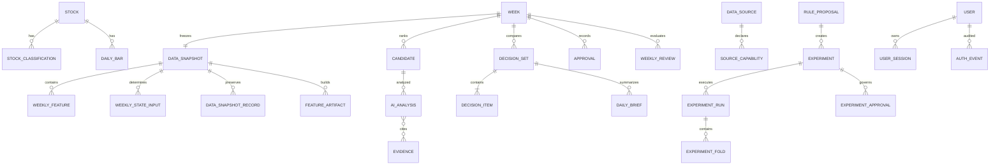

# API 与数据库设计

> 状态：MVP 契约初稿；实验 DSL、能力矩阵、特征产物与治理 API 已完成旁路后端基线和迁移，实验激活默认关闭。开发时据此生成正式OpenAPI并保持兼容。

## 1. API约定

- 前缀：`/api/v1`。
- JSON字段使用 `snake_case`，时间为ISO 8601带时区。
- 错误结构统一：`code`、`message`、`details`、`request_id`。
- 写操作支持幂等键；发布、审批和任务重试必须幂等。
- 摘要与审计接口分离，默认页面不拉取大体积证据。

## 2. 核心接口

| 方法与路径 | 用途 |
|---|---|
| `POST /auth/login` | 用户名密码登录并建立服务端会话 |
| `GET /auth/me` | 返回当前用户与角色 |
| `POST /auth/logout` | 撤销当前会话 |
| `GET/POST /users` | 管理员查看及新增普通用户 |
| `PATCH /users/{user_id}` | 管理员启用或停用普通用户 |
| `GET /weeks/current` | 本周L0摘要与实际发布标的 |
| `GET /weeks/{week_id}` | 指定周摘要 |
| `GET /weeks/{week_id}/candidates` | 候选、备选、科创参考和落选原因 |
| `GET /weeks/{week_id}/decisions` | 规则、AI、人工三版本差异 |
| `POST /weeks/{week_id}/approval` | 接受、驳回或修改AI名单 |
| `POST /weeks/{week_id}/publish` | 幂等发布正式名单，仅允许已批准状态 |
| `GET /stocks/{code}` | 个股L1/L2摘要 |
| `GET /stocks/{code}/evidence?week_id=` | 证据与数据来源 |
| `GET /weeks/{week_id}/audit` | L3规则、AI、工具和人工审计 |
| `GET /weeks/{week_id}/reviews` | 周终规则、AI、人工发布及研究回放结果 |
| `GET /reviews` | 历史数据页全部激活复盘，按周倒序 |
| `GET /history/weeks` | 历史页周目录；正式名单、日报或复盘任一存在即纳入，避免部分完成周被隐藏 |
| `GET /reviews/latest` | 最新周复盘（保留给摘要消费者，不在主页展示正文） |
| `GET /replays/{week_id}` | 历史时点回放、每日简报与周终结果 |
| `GET /weeks/{week_id}/briefs` | 当周每日简报列表与最新状态 |
| `GET /stocks/search?q=` | 搜索可加入本人自选的有效沪深 A 股 |
| `GET/POST /me/watchlist` | 查看或加入本人自选；服务端限制最多 5 只 |
| `DELETE /me/watchlist/{stock_code}` | 移除本人自选，不回写既有产出 |
| `GET /me/watchlist/weeks/{week_id}/briefs` | 本人该周自选日报，按交易日分组 |
| `GET /me/watchlist/weeks/{week_id}/review` | 本人该周实际关注期间的周终复盘 |
| `GET /weeks/{week_id}/briefs/{trade_date}` | 指定交易日简报详情 |
| `POST /jobs/weekly-selection` | 手动触发周初任务，默认仅所有者 |
| `POST /jobs/output` | 管理员手动触发指定交易日日报或指定自然周周终复盘 |
| `GET /replays/eligible-weeks` | 管理员查询已越过正式窗口且满足日历边界的历史回溯周/交易日 |
| `POST /replays/prepare-calendar` | 管理员 + CSRF 显式使用官方/备份交易日历准备目标周；质量不足或来源不可用时不创建任务 |
| `POST /jobs/replay` | 管理员排队隔离历史回溯；支持周初、日报（单日/补齐缺失）和周终三阶段 |

既有人工补生成日报和周终复盘保留正式身份。统一规则为：下一交易周首个开市日开始前，目标周仍处于正式窗口；开始后才进入隔离回溯链。
| `GET /replay-runs/{run_id}` | 查看回溯运行及每个阶段的状态、截止、指纹、警告和失败审计 |
| `GET /weeks/{week_id}/replays` | 查看某周所有隔离回溯运行，历史页与正式数据分区展示 |
| `GET /ai/connection` | 登录用户查看本人个人凭据/系统凭据连接状态，不返回完整密钥 |
| `POST /ai/connection` | 登录用户 + CSRF 加密保存或替换本人 OpenAI API Key |
| `DELETE /ai/connection` | 登录用户 + CSRF 删除本人个人凭据 |
| `POST /ai/tasks` | 登录用户 + CSRF 触发复盘解读/错误归因；周初分析与规则迭代仍限管理员 |
| `GET /ai/invocations/{invocation_id}` | 登录用户查看结构化 AI 调用审计 |
| `GET /ai/audits` | 登录用户按 capability 查看 AI 审计 |
| `GET /weeks/{week_id}/attributions` | 登录用户查看错误归因提案 |
| `POST /attributions/{attribution_id}/resolution` | 管理员 + CSRF 确认或拒绝归因 |
| `GET /weeks/{week_id}/jobs` | 管理员查看该周最近任务、阶段与安全失败原因 |
| `GET /jobs/{job_id}` | 任务状态与错误 |
| `GET /experiments` | 实验列表与结果摘要 |
| `POST /experiments/rule-proposals` | 创建受限 DSL 实验提案；AI调用也只能获得此权限 |
| `POST /experiments/rule-proposals/{proposal_id}/validate` | 执行 Schema、特征、时点、参数和权限静态校验 |
| `POST /experiments/rule-proposals/{proposal_id}/replays` | 管理员启动版本化 walk-forward 回放 |
| `GET /experiments/{experiment_id}/folds` | 查看各折输入指纹、样本和多目标指标 |
| `POST /experiments/{experiment_id}/shadow` | 管理员启动不影响正式发布的实时影子运行 |
| `POST /experiments/{experiment_id}/approval` | 用户批准或驳回实验升级 |
| `POST /experiments/{experiment_id}/activate` | 激活已批准且再次通过门禁的正式版本 |
| `POST /experiments/{experiment_id}/rollback` | 回滚至实验预先指定的正式版本 |
| `GET /health/sources` | 数据源与降级状态 |
| `GET /health/source-capabilities` | 数据集覆盖、时点语义、正式资格和主备策略矩阵 |
| `GET /health/features` | 特征清单、分区、哈希、构建进度与可重建状态 |
| `POST /jobs/{job_id}/cancel` | 请求协作式取消；不打断当前原子事务 |
| `GET/PATCH /settings` | 科创、AI权限和发布模式配置 |

人工审批请求最小结构：

```json
{
  "action": "accept_ai",
  "selected_codes": ["002472", "000977", "002371", "300750", "600276"],
  "reason": "接受AI换入，保持规则约束。",
  "decision_version": 3
}
```

版本不匹配时返回冲突，避免覆盖新的AI结果。

`GET /weeks/current` 只返回当前自然周中 `published` 且激活的数据库决策集；没有结果时返回404。接口不得读取进程内演示变量，也不得回退到旧迁移暂存表。

## 3. 核心实体



## 4. 主要表

| 表 | 关键字段与约束 |
|---|---|
| `stocks` | `id`, `code`, `exchange`, `board`, `name`, `listing_date`, `status`, `source`, `quality`, `fetched_at`, `content_hash`, `last_seen_at`; code+exchange唯一 |
| `stock_classifications` | `stock_id`, `classification_type`, `label`, `domain`, `sector_code`, `source`, `quality`, `published_at`, `evidence_url`, `valid_from`, `valid_to`; 同来源分类保留历史有效期，数据库限制每只股票最多一个当前 `pawe_primary` |
| `trading_calendar` | `trade_date`, `is_open`, `previous_open_date`, `source`, `quality`, `fetched_at`, `content_hash` |
| `daily_bars` | `stock_id`, `trade_date`, OHLCV, amount, adjustment, source, quality, fetched_at, content_hash；股票+日期+复权+来源+内容哈希唯一，保留前复权修订版本 |
| `data_snapshots` | `id`, `as_of`, `created_at`, `quality`, `content_hash`, `locked_at` |
| `data_snapshot_records` | `snapshot_id`, `record_key`, `source`, `as_of`, `fetched_at`, `published_at`, `adjustment`, `quality`, `payload`, `content_hash`；快照+记录键+来源唯一 |
| `weekly_features` | `snapshot_id`, `stock_id`, `feature_version`, `payload`, `content_hash`；快照+股票+特征版本唯一 |
| `feature_artifacts` | `snapshot_id`, `partition_key`, `schema_version`, `feature_version`, `code_version`, `decision_cutoff`, `source_hashes`, `row_count`, `content_hash`, `quality`, `status`, `uri`; 只登记已原子发布或明确失败的分区 |
| `weekly_state_inputs` | `snapshot_id`, `input_version`, `payload`, `content_hash`；保存可重放的 V9 市场状态输入 |
| `weeks` | `week_id`, `status`, `market_state`, `snapshot_id`, `rule_version` |
| `candidates` | `week_id`, `stock_id`, `rule_score`, `rank`, `bucket`, `exclusion_reasons` |
| `ai_analyses` | `candidate_id`, `model_version`, `prompt_version`, adjustment, probabilities, evidence, audit_status |
| `decision_sets` | `week_id`, `type`(rule/ai/published), `version`, `status`, `fingerprint`; 每类仅一个激活版本 |
| `decision_items` | `decision_set_id`, `stock_id`, `rank`, `role`, target, confidence, reasons |
| `approvals` | `week_id`, `decision_version`, `action`, `selected_codes`, `reason`, `created_at` |
| `historical_replays` | 模拟时点、实际抓取时点、规则结果、逐日简报与审计警告 |
| `weekly_reviews` | `week_id`, `source_type`, `decision_set_id/replay_run_id`, 组合指标、总结与报告 |
| `weekly_review_items` | 逐标的周内最高、周终、回撤、触达、基准及行业超额 |
| `user_watchlist_items` | 用户、股票、加入时间、生效交易日和移除时间；每用户同一时刻同一股票唯一 |
| `user_watchlist_daily_items` | 用户自选逐日冻结产出；用户、交易日、股票唯一 |
| `user_watchlist_weekly_items` | 用户自选实际关注期间的周终产出；用户、自然周、股票唯一 |
| `daily_briefs` | `week_id`, `trade_date`, `decision_set_id`, `version`, `status`, `as_of`, `quality`, `summary`; 每个交易日每个正式决策版本仅一个激活版本 |
| `legacy_migration_batches` | 旧资料只读清单批次与清单哈希，不保存运行时依赖路径 |
| `legacy_documents_staging` | 旧文档来源哈希、解析质量、关联来源和验证状态 |
| `legacy_items_staging` | 旧主池/备选解析值、独立行情复算状态、证据型冲突归因、回放资格与实验臂；不得被正式决策链直接引用 |
| `daily_brief_items` | `daily_brief_id`, `decision_item_id`, 日涨跌、量能、证据和AI摘要；既有周度字段仅作历史兼容与周终内部计算，不进入日报展示 |
| `evidence` | `id`, `kind`, `source`, `published_at`, `fetched_at`, `quality`, `payload_ref` |
| `rule_proposals` | `schema_version`, `base_rule_version`, `scope`, `dsl`, `hypothesis`, `objective`, `required_features`, `invalidation_conditions`, `rollback_version`, `status`, `created_by`; DSL 不保存可执行代码 |
| `experiments` | 提案、目标、基线、变更、生命周期状态、正式版本隔离标记与回退版本 |
| `experiment_runs` | `experiment_id`, `run_type`(replay/shadow), `input_fingerprint`, `status`, `started_at`, `finished_at`, `metrics`, `failure_reason`；重试新增记录 |
| `experiment_folds` | `run_id`, `fold_index`, 训练/选择/验证窗口、快照集合、样本数、集合容量分布、逐目标指标和完整性状态 |
| `experiment_approvals` | `experiment_id`, `experiment_version`, `action`, `reason`, `created_by`, `created_at`; 版本冲突时拒绝 |
| `jobs` | 类型、状态、阶段、检查点、取消请求、重试、错误、开始/结束时间 |
| `source_health` | 来源、线路、质量、最后成功、错误和延迟 |
| `source_capabilities` | `source_id`, `adapter_version`, `dataset`, `capabilities`, `market_coverage`, `time_semantics`, `auth_mode`, `terms_reviewed_at`, `formal_eligibility`, `fallback_priority`, `policy`, `updated_at` |
| `source_mapping_versions` | 来源字段映射、单位/枚举转换、白名单派生、Schema、验证状态和批准记录；未批准版本只能写暂存区 |
| `settings` | 版本化配置，不保存明文密钥 |
| `users` | 规范化用户名、Argon2id密码哈希、角色、启停状态和登录时间 |
| `user_sessions` | 用户、会话/CSRF令牌摘要、过期和撤销时间；不保存原始令牌 |
| `auth_events` | 登录成功/失败、用户创建/启停等最小认证审计 |

## 5. 状态与不可变性

- `data_snapshots.locked_at` 设置后不可原地改写。
- 周度特征和市场状态输入必须绑定冻结快照与 Schema 版本；同版本载荷以规范 JSON 哈希校验，不允许盘后覆盖周初输入。
- 技术特征查询必须同时限制 `trade_date <= as_of` 和 `fetched_at <= snapshot_cutoff`，同一交易日只选择截止时点可见的最新内容版本。
- `published` 决策集发布后不可修改；修正必须创建新版本并保留原版。
- 周初任务只有 `awaiting_approval` 才能审批，只有 `approved` 才能发布。
- 实验结果不得写入正式决策表的激活版本。
- `feature_artifacts` 只有 `published` 状态可被规则或回放读取；临时 URI 不进入正式清单，取消或失败不得暴露半成品。
- 实验服务角色只能写提案和实验表，不能写 `published` 决策集或正式规则激活指针。激活接口必须同时满足 `approved`、回放与影子门禁、回退版本存在、版本未冲突，并重新运行硬约束回归。
- 规则提案状态变化采用乐观版本锁；跳级、回写历史状态或以重试覆盖原运行均返回冲突。

周初门禁顺序固定为：完整交易日历（自然周至少 3 个交易日）→ 上一交易日 15:00 后准备窗口与下一交易周尚未开始 → 上一交易日 15:00 冻结快照 → 版本化 V9 特征与市场状态输入 → 规则执行。错过原计划执行时间但下一交易周尚未开始时按正式补生成处理，实际获取时间必须保留，任何输入仍不得晚于原始信息截止点。下一交易周开始后返回 `FORMAL_WEEK_ENDED` 并要求使用历史回溯。

手动周初、日报和周终复盘均需先在决策管理确认弹窗中明确确认。服务端先检查目标周对应正式产出：成功产出已经存在时复用，不重复执行；尚未产出时进入幂等队列。自动任务失败或未产出时，管理员可在下一交易周开始前使用相同正式逻辑补跑，不能绕过阶段到期时间、原始信息截止点、完整交易周、正式发布名单和数据质量门禁。worker 在交易日收盘后由 15:30 单一任务依次拉取正式名单与个人自选行情并生成日报；对缺失日报逐日补做，单日失败不阻断其他日期。最后交易日的正式日报全部齐备后立即触发周终复盘。复盘复用已落库行情，只补拉规则/AI/发布版本差异标的、同领域样本缺失交易日，并独立读取沪深300基准。任务状态由持久化事件恢复；历史页取正式内容与已成功完成回溯周的并集。

正式与回溯窗口按交易周统一分离：下一交易周首个开市日 00:00 前，目标周所有已到期阶段均为 formal；到达该边界后才允许 replay。周初模拟信息截至首个交易日前一交易日 15:00，日报截至目标交易日 15:00 且 15:30 后才到期；周终信息仍截至最后交易日 15:00 收盘，但只有该周全部正式日报齐备后才执行，最早为最后交易日 15:30。产品界面只在“周初名单”确认弹框保留一个回溯入口，提交时以 `weekly_review` 为目标阶段，由依赖顺序一次生成周初名单、全周日报和周终复盘。回溯请求通过 `replay_runs` 和 `replay_stage_runs` 管理隔离产出，不改写正式决策、审批、发布或日报；仅成功完成的整周回溯进入历史周目录。

AI 审计表 `ai_invocations`/`ai_audits` 记录结构化调用边界；关闭或缺 key 时记录 `skipped/degraded` 而不生成 Mock 结论，Mock 仅可由测试显式注入。`ai_candidate_analyses` 只保存周初 shadow 候选分析；`error_attributions` 与 `attribution_resolutions` 使用 docs/03 的正式策略 taxonomy 保存人工闭环。规则演化只能调用现有 DSL validator 做预检并写入 `rule_proposals.status=proposed`，不得从 AI 入口推进后续实验状态机。

输入全部通过后，任务确定性重建 `FrozenSnapshot`，执行唯一 V9.0 规则入口并持久化候选、规则基准与待审批决策。相同快照和规则指纹的重复任务复用现有规则版；同周快照或规则指纹冲突时停止，不覆盖已有基线。规则无合格标的时保存候选审计但不创建空决策集。

周度规则组合容量为 1～5，5 是目标和上限。发布接口必须拒绝空集合、超过 5 只、任何未通过硬约束的股票，以及缺少逐标的目标情景、触达概率、证据、风险或失效条件的项目；零合格候选保持 `NO_ELIGIBLE_CANDIDATE` 并不创建发布版。

## 6. 索引与保留

- 行情按股票与日期建立复合索引；候选按周与排名索引；证据按股票/发布时间索引。
- PostgreSQL保存业务状态和必要摘要；大体积历史响应与回放数据使用Parquet/文件对象并记录校验值。
- PostgreSQL 中的冻结快照和 `feature_artifacts` 清单是权威状态；Parquet 是不可变、内容寻址且可重建的加速产物，DuckDB 仅用于读取分析，不允许反向更新正式业务表。
- 原始公开数据、决策审计和正式发布记录的保留策略在云部署前确定；正式决策链不得随普通缓存清理删除。

## 7. 安全边界

- 健康检查保持公开；其他业务接口必须登录。管理员可完整使用和管理普通用户；普通用户除本人自选的增删外，其他业务接口保持只读。任何自选查询都从登录主体派生 `user_id`，客户端不能指定其他用户。
- 本机开发仅绑定loopback；服务端会话使用 HttpOnly、SameSite Cookie，写操作同时校验 CSRF；云端必须启用 Secure Cookie 与 HTTPS。
- AI与数据源密钥由后端环境配置读取，接口只返回是否已配置。
- 审计接口不返回密钥、完整内部提示中的敏感配置或不必要的原始网页内容。
